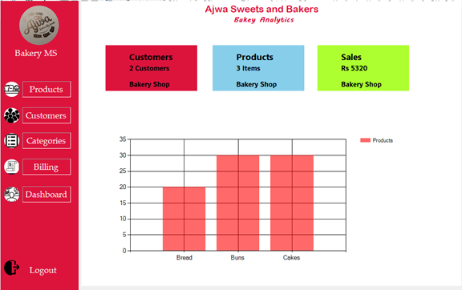
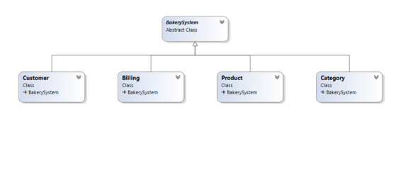
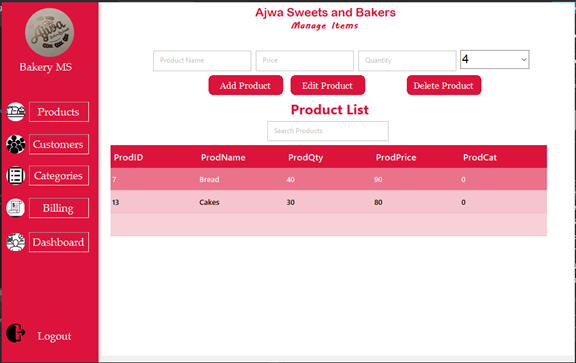
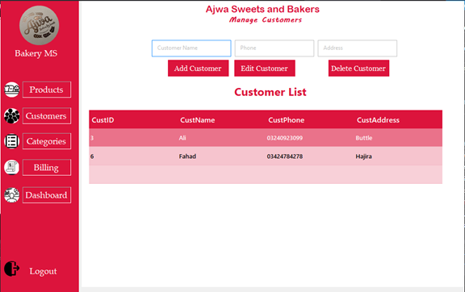
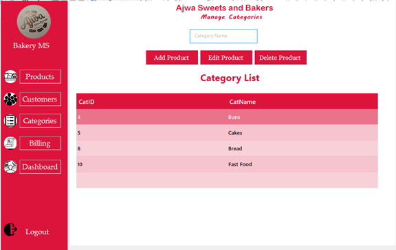
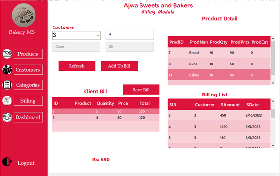
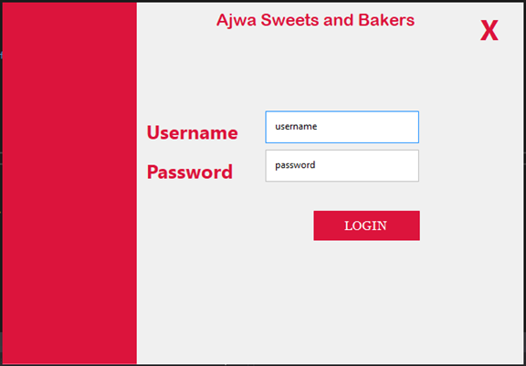

# Bakery Management System

A comprehensive Windows Forms application built with C# that demonstrates Object-Oriented Programming principles for managing bakery operations including products, customers, categories, and billing.



## Table of Contents
- [Overview](#overview)
- [Features](#features)
- [OOP Implementation](#oop-implementation)
- [System Architecture](#system-architecture)
- [Interface Screenshots](#interface-screenshots)
- [Database Schema](#database-schema)
- [Setup Instructions](#setup-instructions)
- [Usage Guide](#usage-guide)
- [Technical Requirements](#technical-requirements)

## Overview

The Bakery Management System is a desktop application designed to streamline bakery operations through an intuitive interface. Built using C# Windows Forms and SQL Server, this project showcases comprehensive implementation of Object-Oriented Programming concepts including inheritance, encapsulation, abstraction, and polymorphism.

The system provides complete CRUD (Create, Read, Update, Delete) operations for managing products, customers, categories, and billing processes, along with a dashboard for business analytics and reporting.

## Features

### Core Functionality
- **Product Management**: Add, edit, delete, and search bakery products
- **Customer Management**: Maintain customer database with contact information
- **Category Management**: Organize products into categories
- **Billing System**: Generate bills and track sales
- **Dashboard Analytics**: Visual representation of business data with charts
- **Search Functionality**: Real-time search across all modules
- **Secure Login**: Username/password authentication system

### Technical Features
- **Multi-page Interface**: Tabbed navigation using Bunifu UI components
- **Data Visualization**: Interactive charts for product quantity tracking
- **Exception Handling**: Comprehensive error management
- **Database Integration**: SQL Server connectivity with parameterized queries
- **Responsive UI**: Modern interface with Bunifu UI framework

## OOP Implementation

This project demonstrates advanced Object-Oriented Programming concepts:

### Abstraction
- **BakerySystem**: Abstract base class defining common functionality
- Abstract method `searchRecord()` implemented differently by each child class
- Encapsulation of database connection logic

### Inheritance
- **Product**, **Customer**, **Category**, and **Billing** classes inherit from `BakerySystem`
- Shared functionality like `displayElements()` inherited from parent class
- Specialized implementations for each business entity

### Encapsulation
- Private fields with public properties (getter/setter methods)
- Data validation within class methods
- Protected database connection accessible to child classes

### Polymorphism
- **Method Overloading**: Multiple constructors and method signatures
- **Method Overriding**: Each class implements `searchRecord()` differently
- **Runtime Polymorphism**: Abstract method implementation

### Additional OOP Features
- **Constructor Overloading**: Multiple initialization options
- **Destructors**: Proper resource cleanup with garbage collection
- **Exception Handling**: Try-catch-finally blocks for robust error management

## System Architecture



### Class Structure

```
BakerySystem (Abstract)
├── Product
├── Customer
├── Category
└── Billing
```

### Key Classes

#### BakerySystem (Abstract Base Class)
- Manages database connections
- Provides common `displayElements()` method
- Defines abstract `searchRecord()` method

#### Product Class
- Manages bakery products (name, price, quantity, category)
- Handles product CRUD operations
- Generates product analytics for dashboard

#### Customer Class
- Manages customer information (name, phone, address)
- Implements customer CRUD operations
- Provides customer counting for dashboard

#### Category Class
- Manages product categories
- Handles category CRUD operations
- Populates category dropdowns

#### Billing Class
- Manages billing operations
- Handles invoice generation
- Saves sales data to database

## Interface Screenshots

### Products Management


### Customer Management


### Category Management


### Billing System


### Dashboard Analytics


### Login Screen


## Database Schema

The system uses SQL Server with the following main tables:
- **ProductTbl**: Stores product information
- **CustomerTbl**: Stores customer data
- **CategoryTbl**: Stores product categories
- **SalesTbl**: Stores sales/billing records

## Setup Instructions

### Prerequisites
- Visual Studio 2019 or later
- .NET Framework 4.7.2 or later
- SQL Server (LocalDB or full version)
- Bunifu UI Framework

### Installation Steps

1. **Clone the Repository**
   ```bash
   git clone https://github.com/yourusername/bakery-management-system.git
   cd bakery-management-system
   ```

2. **Database Setup**
   - Create a new SQL Server database named `BakeryDB`
   - Update connection strings in the code to match your SQL Server instance
   - Run the database scripts to create required tables

3. **Open Project**
   - Open `BakeryManagementSystem.sln` in Visual Studio
   - Restore NuGet packages
   - Build the solution

4. **Run Application**
   - Set the startup project to `BakeryManagementSystem`
   - Press F5 or click "Start" to run the application

### Login Credentials
- **Username**: `username`
- **Password**: `password`

## Usage Guide

1. **Login**: Use the provided credentials to access the system
2. **Navigation**: Use the sidebar menu to switch between modules
3. **Product Management**: Add products with category, price, and quantity
4. **Customer Management**: Maintain customer database
5. **Billing**: Select products and customers to generate bills
6. **Dashboard**: View analytics and business insights

## Technical Requirements

- **Language**: C# (.NET Framework)
- **UI Framework**: Windows Forms with Bunifu UI
- **Database**: SQL Server
- **IDE**: Visual Studio 2019+
- **Additional Libraries**: 
  - System.Data.SqlClient
  - Bunifu.UI.WinForms
  - System.Windows.Forms.DataVisualization

---

**Project Type**: Object-Oriented Programming Semester Project  
**Course**: OOP
**Framework**: .NET Framework with Windows Forms  
**Database**: SQL Server

## 📄 License

This project is developed for educational purposes as part of an Object-Oriented Programming course.

---

*This project demonstrates comprehensive implementation of OOP principles in a real-world application scenario, showcasing inheritance, encapsulation, abstraction, and polymorphism in a bakery management context.*
